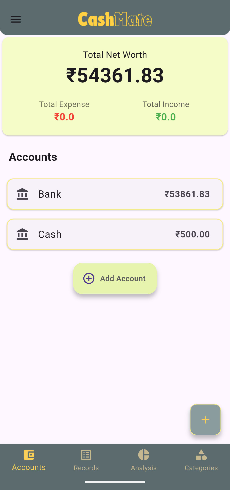
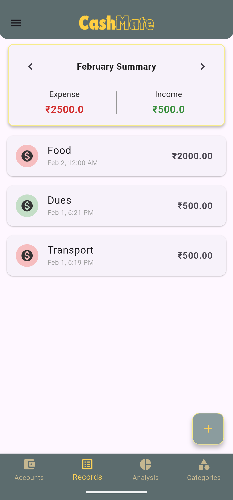
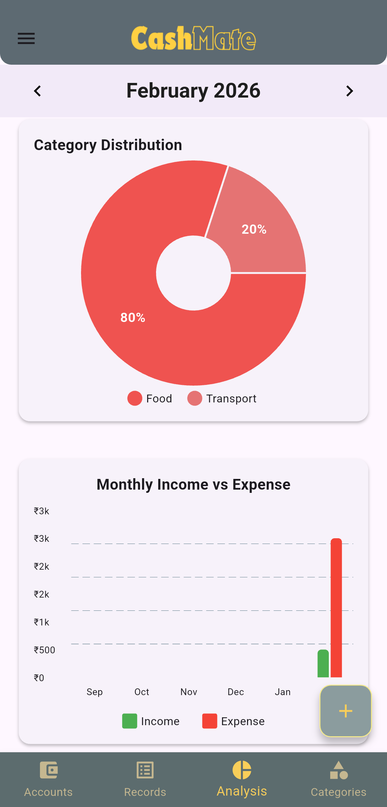
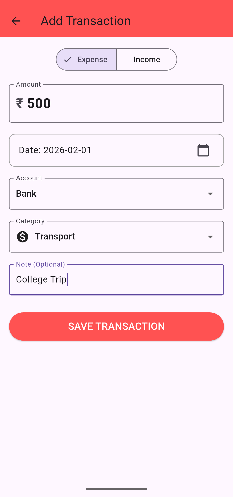
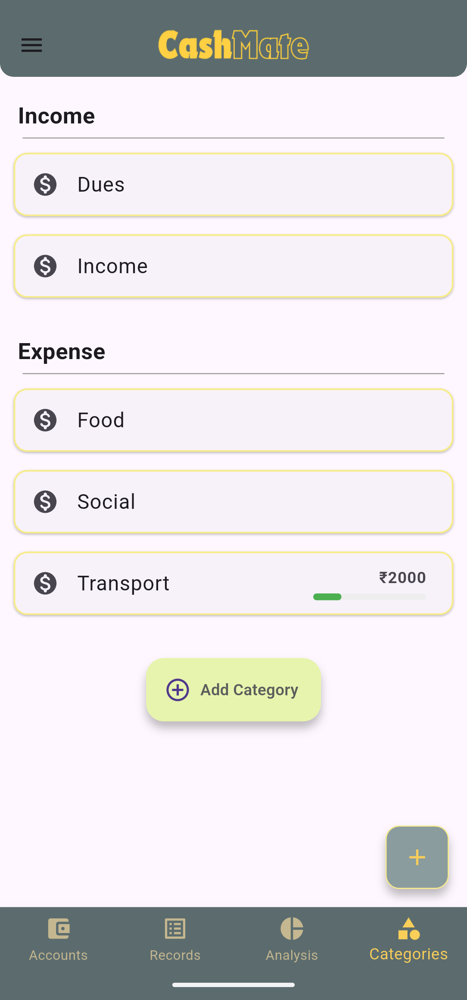

# CashMate 

CashMate is a personal finance and budgeting application built with **Flutter**. It helps users track their income and expenses, manage multiple accounts, and visualize their spending habits through intuitive charts.

> **Note:** This project is currently under active development.

## Features

* **Transaction Tracking:** Easily add income and expenses with notes, dates, and categories.
* **Multi-Account Management:** Track balances across different accounts (Wallet, Bank, Savings, etc.).
* **Visual Analysis:** View monthly spending breakdowns using interactive Donut Charts and progress bars (powered by `fl_chart`).
* **Category Management:** Organize transactions with custom categories and icons.
* **Monthly Records:** View transaction history grouped by month.
* **Local Storage:** All data is stored locally on the device using SQLite, ensuring privacy and offline access.
* **Data Export:** Export your complete transaction history to CSV for external analysis.
<!--## 📱 Screenshots

 | Home / Accounts | Records List | Analysis & Charts | Add Transaction |
|:---:|:---:|:---:|:---:|
| *(Add screenshot)* | *(Add screenshot)* | *(Add screenshot)* | *(Add screenshot)* | -->

## Screenshots

|  |  |

|  |  |

| 

## Tech Stack

* **Framework:** [Flutter](https://flutter.dev/) (Dart)
* **Database:** [sqflite](https://pub.dev/packages/sqflite) (SQLite for local storage)
* **State Management:** `setState` & `StatefulWidget` (Native)
* **Charts:** [fl_chart](https://pub.dev/packages/fl_chart)
* **Formatting:** [intl](https://pub.dev/packages/intl) (Date and currency formatting)

## Getting Started

To run this project locally, you need to have **Flutter** installed on your machine.

1.  **Clone the repository:**
    ```bash
    git clone [https://github.com/yourusername/cashmate.git](https://github.com/yourusername/cashmate.git)
    cd cashmate
    ```

2.  **Install dependencies:**
    ```bash
    flutter pub get
    ```

3.  **Run the app:**
    ```bash
    flutter run
    ```
4.  **Project structure:**

```text
lib/
├── main.dart                  # Entry point & Navigation (Bottom Bar)
├── models/
│   ├── account.dart           # Account data model
│   ├── category.dart          # Category data model
│   └── transaction.dart       # Transaction data model
├── Pages/
│   ├── accounts_page.dart     # Accounts summary screen
│   ├── analysis_page.dart     # Charts & spending breakdown
│   ├── categories_page.dart   # Category management
│   ├── records_page.dart      # Transaction history list
│   └── transaction_page.dart  # "Add Transaction" screen
└── utils/
    └── database_helper.dart   # SQLite database operations
```
## Future Plan

- [ ] Add support for multiple currencies.
- [ ] Implement data backup/export (CSV/PDF).
- [ ] Add dark mode support.
- [ ] Set monthly budget limits per category.

## Contributing

Contributions are welcome! Feel free to open an issue or submit a pull request.
